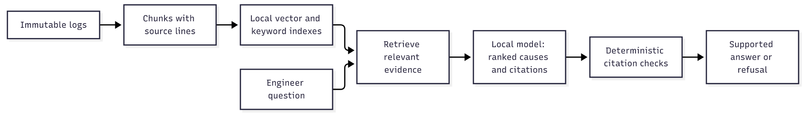

# airgap-rca

Grounded root cause analysis on offline edge accelerators.

## Current status

The active dataset is generated Product_A wafer-sort data: five lots, seven
wafers per lot, and 112 DUTs per wafer. No Product_A DUT was physically
measured. But engineer-reviewed Product_A investigation, corrective
action, retest, or confirmed-cause records for six synthetic cases.

Block 2 now produces exact source-linked DUT observation chunks; Block 3
builds local SQLite FTS5 keyword and hashed TF-IDF vector indexes. The vector
baseline is lexical, not a pretrained semantic embedding model. A cause
suggestion pipeline, deterministic answer verification, and edge-board
benchmarking remain unimplemented.

## Data and retrieval

- [Product_A readable logs and validation](syn_data/product_a_v1/README.md)
- [Product_A STDF files for viewers](syn_data/STDF_a_v1/README.md)
- [Block 2 and Block 3 commands, evidence boundaries and limitations](docs/product_a_retrieval.md)

The failure distributions were chosen for the demonstration. Neither the
observed test nor its bin establishes a physical root cause. When the ATE
engineers review investigation scenarios, link those records as separate
evidence with their review status and appropriate historical/current split.

## Proposed workflow

The diagram describes the whole intended system.
