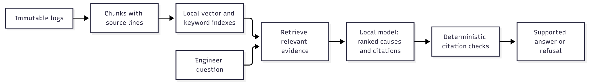

# airgap-rca

Grounded root cause analysis on offline edge accelerators.

## Current status

The active dataset contains 3,920 synthetic Product_A wafer-sort observations
(five lots, 35 wafers) and six curated historical scenarios. Engineering
guidance informed possible causes and investigation procedures. The simulated
investigation, action and retest outcomes are **not physically tested and not
reviewed**. They are not confirmed real-world diagnoses.

Both Jetson Orin Nano (TensorRT Edge-LLM) and RB3 Gen 2 (QNN HTP) run the same
local investigation flow with Qwen3.5-0.8B. LlamaIndex queries a local Chroma
index and the application follows linked, source-hashed historical records.

The local app presents a browser form for a failure observation and an
engineer's question. Qwen selects evidence IDs; code supplies source-owned
text and citations. Invalid selections are rejected. Free-form chat is
experimental. Source validation is not proof that a hypothesis explains the
current DUT.

- [Local app setup, supported inputs and limitations](docs/local-app.md)
- [Observed Jetson integration progress](docs/jetson-progress.md)
- [Frozen evaluation and proxy-label limits](docs/evaluation.md)
- [RB3 backend setup](docs/rb3-integration.md)
- [Saved-run citation audit and board measurement](docs/measurement.md)
- Start the app: `python -m src.rca_local` inside the Jetson environment.
- Run software tests: `python -m unittest discover -s tests -v`.

Both boards completed the same frozen 50-question hybrid-retrieval proxy
evaluation: 40 unconfirmed suggestions and 10 refusals each, including all 10
unsupported questions. The Jetson median/p95 end-to-end latencies were
15.72/16.81 s; RB3 measured 33.48/37.29 s. Both matched the AI-derived proxy
key based on the same synthetic historical scenarios. Source audits checked
110/110 Jetson and 132/132 RB3 displayed citations. Jetson board input averaged
7.60 W, peaked at 13.11 W, and averaged 104.98 J per triage. RB3 power and
independently reviewed diagnostic accuracy remain unmeasured; the disconnected
cold-boot test, ablations, and paper are also open.
The two runtimes also differ in precision and engine lifecycle. This is a
research prototype, not a production RCA service.

## Proposed workflow

The diagram describes the whole intended system.

The diagram describes the target architecture; not all acceptance criteria
have been demonstrated.

